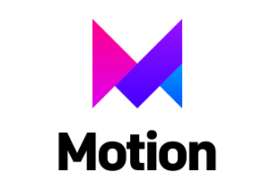
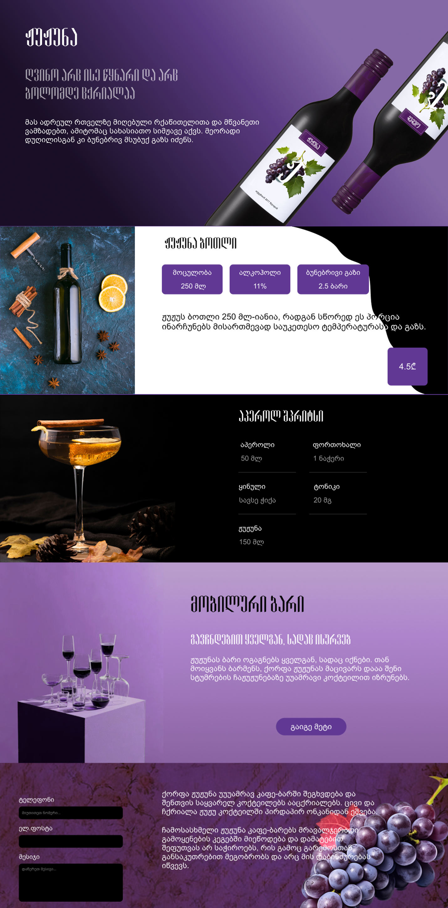

# Zhuzhuna vine landing page

### Table of Contents

- [Prerequisites](#Prerequisites)
- [Tech Stack](#Tech-Stack)
- [Interaction](#Interaction)
- [Screenshot](#Screenshot)
- [Links](#Links)
- [Getting Started](#Getting-Started)
- [Deployment](#Deployment)
- [Structure](#Structure)
- [Author](#Author)

### Prerequisites

-  _npm: Node Package Manager for JavaScript_
-  _Vite: Frontend build tool for modern web development_
-  _Javascript: Scripting language for dynamic web development._

### Tech Stack

-  _Tailwind CSS: Utility-first CSS framework for rapid UI development._
-  _React JS: A powerful JavaScript library for building fast, interactive, and reusable user interfaces_
-  Framer Motion: React animation library for smooth, high-performance UI transitions.

### Interaction

Users are able to:

- View the optimal layout of the landing page across different screen sizes, ensuring a responsive design.
- Toggle between light and dark modes to enhance user experience based on preference.
- Change the language of the page dynamically, with automatic detection to show Georgian if the user is in Georgia;  
  otherwise, display in English.
- Fill out forms and send messages directly from the app to an email address.
- Receive notifications upon form submission to confirm successful submission.
- See hover effects and interactive elements throughout the page for an engaging user interface.
- Keep track of any changes and user interactions, even after refreshing the browser.

### Screenshot



### Links

- Solution URL: [Add solution URL here](https://github.com/DavitDvalashvili/zhuzhuna-wine/tree/main)
- Live Site URL: [Add live site URL here](https://zhuzhuna-wine.vercel.app/)

### Getting Started

1. First of all you need to clone app repository from github:

```
git clone https://github.com/DavitDvalashvili/zhuzhuna-wine.git
```

2. Next step requires install all the dependencies.

```
npm install
```

3. To see project in action

```
npm run dev
```

### Deployment

Before every deployment you need to create build file.

```
npm run build
```

after this you can use this file to deploy project on server.

## Structure

```
├── public/
│ ├── index.html
│ ├── images/
│ │ └── [image files]
├── src/
│ ├── assets/
│ │ └── fonts.css
│ ├── components/
│ │ ├── Button.jsx
│ │ ├── header/
│ │ │ ├── Navbar.jsx
│ │ │ ├── ThemeSwitcher.jsx
│ │ │ └── LanguageSwitcher.jsx
│ ├── layout/
│ │ ├── Footer.jsx
│ │ └── Header.jsx
│ ├── animations/
│ │ └── animationVariants.jsx
│ ├── sections/
│ │ ├── About.jsx
│ │ ├── News.jsx
│ │ ├── Bottle.jsx
│ │ ├── Cocktails.jsx
│ │ └── Contact.jsx
│ ├── context/
│ │ └── LanguageContext.jsx
│ ├── hooks/
│ │ ├── useAnimateOnScroll.jsx
│ │ ├── useCountry.jsx
│ │ └── useWindowWidth.jsx
├── README.md

```

### Author

- Github profile - [Add your name here](https://github.com/DavitDvalashvili)
- Linkedin profile - [Add your name here](https://www.linkedin.com/in/davit-dvalashvili-0421b6253)
- Email - [@your_username](davitdvalashvili@gmail.com)

#### The Zhuzhuna Vine landing page is created for internship purposes, and the copyright of the project design is owned by [LineDevLTD](https://www.linkedin.com/company/linedevltd)
